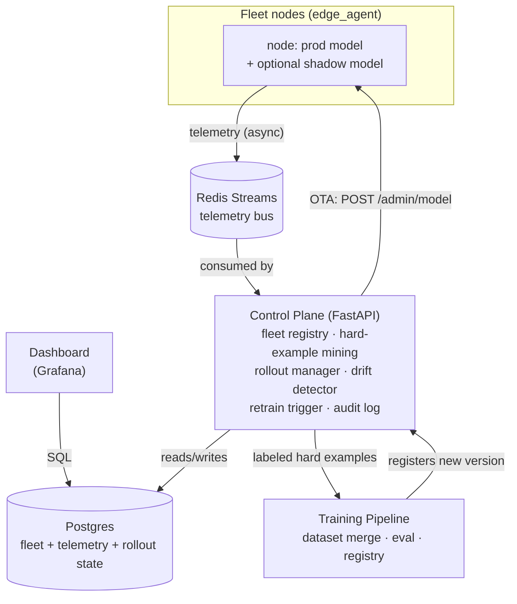

# ShadowFleet

[](https://github.com/arvindxyogesh/shadowfleet/actions/workflows/edge-agent-ci.yml)
[](https://github.com/arvindxyogesh/shadowfleet/actions/workflows/control-plane-ci.yml)
[](https://github.com/arvindxyogesh/shadowfleet/actions/workflows/training-pipeline-ci.yml)

A closed-loop **fleet data engine** for computer vision, scaled down from
production systems (Tesla Autopilot/FSD, Waymo) to run entirely on free-tier /
self-hosted tools.

The CV task (object detection on dashcam frames) is deliberately ordinary — the
point of this project is the software system around the model: fleet telemetry,
shadow-mode evaluation, hard-example mining, auto-triggered retraining, canary
rollout, and drift-triggered rollback.

**Start here:** [`docs/SRS.md`](docs/SRS.md) — full Software Requirements
Specification (architecture, functional/non-functional requirements, data
contracts, roadmap).

## Architecture



The loop: a node's inference telemetry streams to the control plane, which
mines hard examples, triggers `training_pipeline` once enough accumulate,
and — once a new model is registered — runs a canary rollout: push to a
subset of nodes in shadow mode, compare their metrics against the rest of
the fleet, and either promote (no regression) or automatically roll back
(drift detected). Every step is logged to an audit trail the dashboard
surfaces. See `docs/SRS.md` §3 for the full requirements-level version of
this diagram.

## Status

Per the SRS §10 roadmap:

- ✅ **M1** — `edge_agent` inference core (FastAPI + ONNX Runtime, YOLOv8n)
- ✅ **M2** — Shadow-mode serving, telemetry streaming (Redis Streams), and
  the `control_plane` fleet registry (FastAPI + Postgres/SQLite)
- ✅ **M3** — Hard-example mining (`control_plane`) + a manually-triggered
  `training_pipeline` (dataset merge, promotion evaluation, versioned
  model registry)
- ✅ **M4** — Grafana dashboard (fleet status, telemetry trends,
  hard-example counts), provisioned against `control_plane`'s Postgres —
  see `dashboard/README.md`
- ✅ **M5** — The closed loop: auto-triggered retraining (FR-5), canary
  rollout with OTA model hot-swap (FR-8), drift-based automatic rollback
  (FR-9), manual pause/resume/rollback with an audit log (FR-11) — see
  `control_plane/README.md`'s "Closed loop" section
- ✅ **M6** — Portfolio polish: `make demo`, a Hugging Face Spaces
  deployment scaffold for the inference API, this README, and CI badges
  (see "Demo" below)

Run the current stack locally via `infra/docker-compose.yml` — see
[`infra/README.md`](infra/README.md).

## Demo

```bash
make export-model   # one-time: produces edge_agent/models/yolov8n.onnx
make up              # docker compose up --build -d
make demo            # sends traffic, watches hard-example mining, runs a canary rollout to completion
```

`scripts/demo.py` prints each step as it happens — fleet status, hard
examples mined, a rollout started and polled through to `completed`, and
the resulting audit log — and doubles as a narration script for recording
a walkthrough video (see `docs/DEMO_SCRIPT.md` for the shot-by-shot
version). It's been run end-to-end against real Redis, real Postgres, and
real inter-service HTTP calls (not just the test suite's fakes) — see the
M6 section of the commit history for what that caught.

A hosted, standalone demo of just the inference API (no fleet/rollout —
free tiers can't sustain a multi-container stack continuously) can be
deployed to Hugging Face Spaces: see
[`deploy/huggingface-spaces/`](deploy/huggingface-spaces/).

## Repository Layout

| Path | Purpose |
|---|---|
| `docs/` | SRS and supporting design docs |
| `edge_agent/` | Fleet node inference service (prod + shadow model serving, OTA hot-swap) |
| `control_plane/` | Fleet registry, hard-example mining, rollout manager, drift detection, audit log |
| `training_pipeline/` | Hard-example consumption, retraining, model registration |
| `dashboard/` | Grafana provisioning + fleet/rollout visualization |
| `infra/` | Docker Compose, CI/CD workflows |
| `scripts/` | `demo.py` — the scripted end-to-end walkthrough |
| `deploy/huggingface-spaces/` | Standalone inference-API deployment scaffold for HF Spaces |

## Tech Stack (all free-tier / self-hostable)

YOLOv8n/YOLO11n · FastAPI · ONNX Runtime · Redis Streams · PostgreSQL · DVC ·
MLflow · Docker Compose · GitHub Actions · Grafana

See SRS §3.4 for the full mapping of each tool to its free-tier basis.
